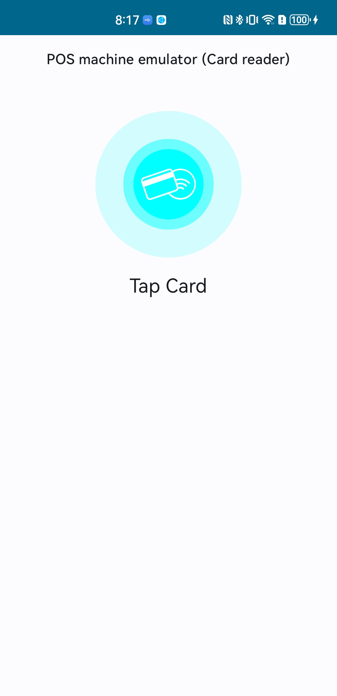
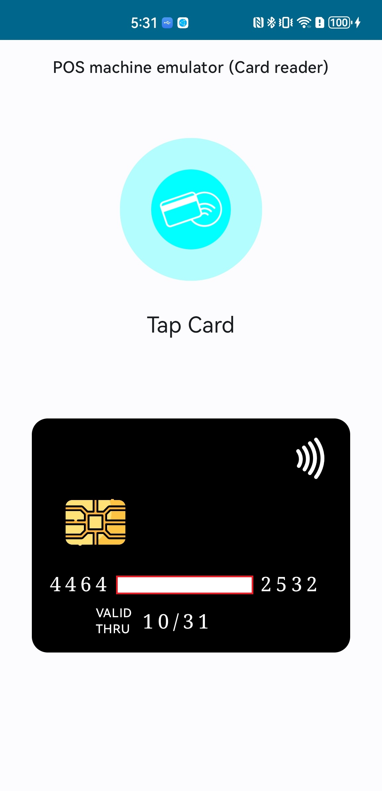

# Card Reader

Simple android app to read EVM cards

## Description

This is a simple NFC card reader app for Android, crated to emulate a POS machine, used to test Host Card Emulation feature

## Screenshots

| Waiting for card                                | card tapped                                     |
| ----------------------------------------------- | ----------------------------------------------- |
|  |  |

## Acknowledgments

- [EMV-NFC-Paycard-Enrollement](https://github.com/devnied/EMV-NFC-Paycard-Enrollment)
